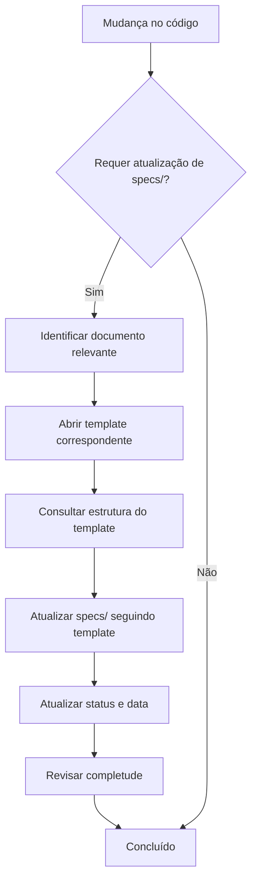

# Convenção: Templates de Documentação

## 📌 Regra Principal

> **TODO documento arquitetural em `specs/` DEVE seguir a estrutura definida nos templates em `.claude/skills/documentation/template/`**

## 🗂️ Mapeamento Template → Specs

| Template                                                                | Specs                                   | Status          |
| ----------------------------------------------------------------------- | --------------------------------------- | --------------- |
| `.claude/skills/documentation/template/001_introduction-and-goals.md`   | `specs/001_introduction-and-goals.md`   | ✅ Implementado |
| `.claude/skills/documentation/template/002_constraints.md`              | `specs/002_constraints.md`              | ✅ Implementado |
| `.claude/skills/documentation/template/003_context-and-scope.md`        | `specs/003_context-and-scope.md`        | ✅ Implementado |
| `.claude/skills/documentation/template/004_solution-strategy.md`        | `specs/004_solution-strategy.md`        | ✅ Implementado |
| `.claude/skills/documentation/template/005_building-block-view.md`      | `specs/005_building-block-view.md`      | ✅ Implementado |
| `.claude/skills/documentation/template/006_runtime-view.md`             | `specs/006_runtime-view.md`             | ✅ Implementado |
| `.claude/skills/documentation/template/007_deployment-view.md`          | `specs/007_deployment-view.md`          | ✅ Implementado |
| `.claude/skills/documentation/template/008_crosscutting-concepts.md`    | `specs/008_crosscutting-concepts.md`    | ✅ Implementado |
| `.claude/skills/documentation/template/009_architectural-decisions.md`  | `specs/009_architectural-decisions.md`  | ✅ Implementado |
| `.claude/skills/documentation/template/010_quality-requirements.md`     | `specs/010_quality-requirements.md`     | ✅ Implementado |
| `.claude/skills/documentation/template/011_risks-and-technical-debt.md` | `specs/011_risks-and-technical-debt.md` | ✅ Implementado |
| `.claude/skills/documentation/template/012_glossary.md`                 | `specs/012_glossary.md`                 | ✅ Implementado |

## 🎯 Responsabilidades

### Documentation Agent (@skill documentation)

**DEVE**:

1. ✅ Consultar o template antes de atualizar qualquer `specs/XXX.md`
2. ✅ Seguir a estrutura definida no template
3. ✅ Manter todas as seções do template (não remover)
4. ✅ Atualizar status e data de última atualização
5. ✅ Adicionar conteúdo relevante nas seções [PREENCHER]

**NÃO DEVE**:

1. ❌ Atualizar specs/ sem consultar o template
2. ❌ Remover seções do template
3. ❌ Ignorar a estrutura do template
4. ❌ Criar estrutura própria diferente do template

### Analyst Agent (@skill analyst)

**DEVE**:

1. ✅ Consultar specs/ para entender arquitetura
2. ✅ Verificar consistência com templates
3. ✅ Identificar gaps na documentação

### Code Review Agent (@skill code-review)

**DEVE**:

1. ✅ Validar conformidade com arquitetura documentada em specs/
2. ✅ Sugerir atualização de specs/ se houver mudança arquitetural

### Development Agent (@skill development)

**DEVE**:

1. ✅ Seguir padrões arquiteturais definidos em specs/
2. ✅ Sinalizar quando implementação diverge de specs/

## 📋 Checklist de Conformidade

Ao atualizar um documento em `specs/`:

- [ ] ✅ Abri o template correspondente em `.claude/skills/documentation/template/`
- [ ] ✅ Verifiquei que todas as seções do template estão presentes
- [ ] ✅ Preenchi as seções relevantes
- [ ] ✅ Atualizei o status (🔴/🟡/🟢)
- [ ] ✅ Atualizei a data de última atualização (YYYY-MM-DD)
- [ ] ✅ Mantive consistência de terminologia com outros docs
- [ ] ✅ Adicionei referências cruzadas se necessário

## 🔄 Fluxo de Atualização



## 📖 Exemplo Prático

### Cenário: Adicionado novo componente de cache

**Passos**:

1. **Identificar documento**: `specs/005_building-block-view.md`
2. **Consultar template**: `.claude/skills/documentation/template/005_building-block-view.md`
3. **Verificar seções do template**:
   - Componentes de Nível 1
   - Componentes de Nível 2
   - Responsabilidades
   - Interfaces
4. **Atualizar specs/**:
   - Adicionar componente de cache na seção apropriada
   - Descrever responsabilidade
   - Documentar interfaces
   - Adicionar diagrama se relevante
5. **Atualizar metadata**:
   ```markdown
   **Status**: 🟢 Completo
   **Última atualização**: 2025-11-04
   ```

## 🚨 Validação

### Como verificar conformidade

```bash
# Para cada documento em specs/
for doc in specs/*.md; do
    template=".claude/skills/documentation/template/$(basename $doc)"
    echo "Verificando: $doc"
    echo "Template: $template"
    # Verificar se seguem mesma estrutura
done
```

### Indicadores de Não-Conformidade

❌ **Problema**: Documento em specs/ sem seções do template
❌ **Problema**: Estrutura diferente do template
❌ **Problema**: Status ou data de atualização ausentes
❌ **Problema**: Seções [PREENCHER] não preenchidas

## 📚 Referências

- Templates: `.claude/skills/documentation/template/`
- Docs reais: `specs/`
- README dos templates: `.claude/skills/documentation/template/README.md`
- Skill de documentação: `.claude/skills/documentation/SKILL.md`

---

**Versão**: 1.0
**Criado em**: 2025-11-04
**Responsável**: Documentation Agent
