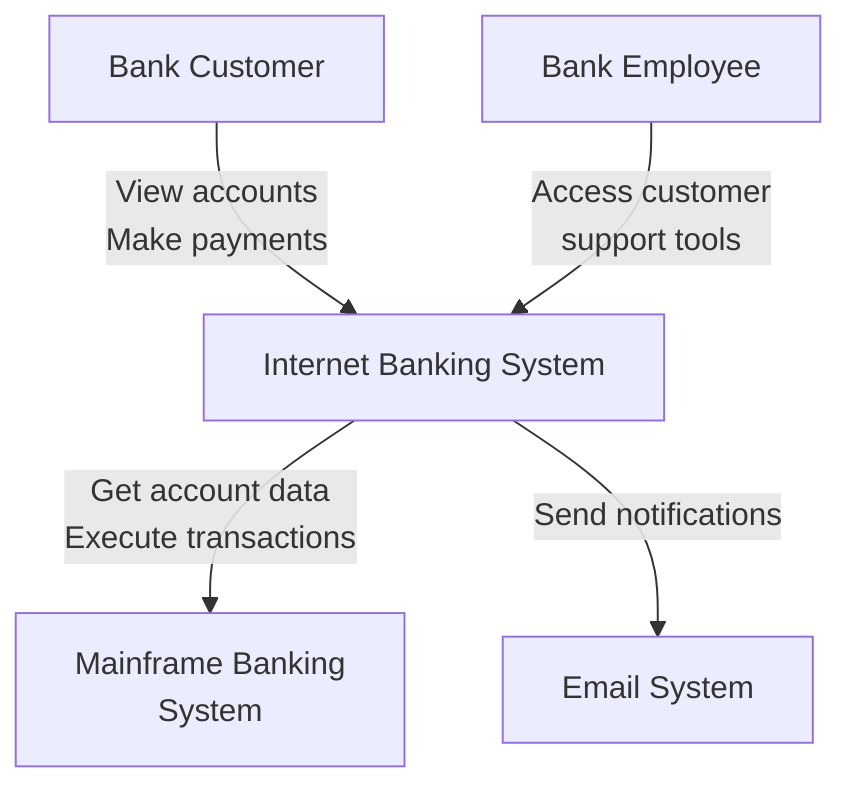
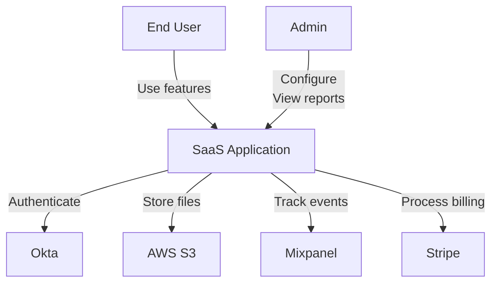

# System Context Diagram (C4 Level 1)

**Template ID**: TPL-C4-001
**Version**: 2.0.0
**Category**: C4 Model
**Level**: C4 Level 1 (System Context)
**Used By**: analyst (Phase 3: Specification), architect (Phase 2: Design)
**Last Updated**: 2025-11-17

---

## Purpose

The **System Context diagram** shows the system in scope and its relationship with users and other systems. This is the **highest level** of abstraction in the C4 Model, providing a "big picture" view that's understandable to both technical and non-technical stakeholders.

**Key Questions Answered**:
- What is the system we're building?
- Who uses it?
- What other systems does it interact with?
- What are the boundaries of our system?

---

## When to Use

- ✅ **Start of new project**: Define system boundaries
- ✅ **Architecture documentation**: Provide high-level overview
- ✅ **Stakeholder communication**: Explain system to non-technical audience
- ✅ **Integration planning**: Identify external dependencies
- ✅ **Arc42 Chapter 3**: System Context and Scope

**Typical Location**:
- `specs/03_context/system-context.md`
- Part of Arc42 Chapter 3 (Context and Scope)

---

## Template Structure

```markdown
# System Context: [System Name]

**System**: [System Name]
**Version**: [Version]
**Last Updated**: [YYYY-MM-DD]

---

## System Overview

[1-2 sentence description of what the system does]

**Example**:
> E-commerce platform that enables customers to browse products, place orders, and track deliveries while providing administrators with inventory management and analytics capabilities.

---

## System Context Diagram

[Visual diagram showing system, users, and external systems]

**Diagram Notation**:
- **Rectangle (Large)**: The system in scope
- **Person Icon**: Users/Actors
- **Rectangle (Small)**: External systems
- **Arrows**: Interactions/Dependencies

### Mermaid Example

\`\`\`mermaid
graph TB
    Customer[Customer<br/>Person]
    Admin[Administrator<br/>Person]

    System[E-commerce Platform<br/>System]

    Auth[Auth0<br/>External System]
    Payment[Stripe<br/>External System]
    Email[SendGrid<br/>External System]
    Shipping[Shipping API<br/>External System]

    Customer -->|Browse products<br/>Place orders<br/>Track deliveries| System
    Admin -->|Manage inventory<br/>View analytics<br/>Configure system| System

    System -->|Authenticate users<br/>HTTPS/OAuth 2.0| Auth
    System -->|Process payments<br/>HTTPS/REST| Payment
    System -->|Send notifications<br/>HTTPS/REST| Email
    System -->|Get shipping rates<br/>Track packages<br/>HTTPS/REST| Shipping
\`\`\`

### PlantUML Alternative

\`\`\`plantuml
@startuml
!include https://raw.githubusercontent.com/plantuml-stdlib/C4-PlantUML/master/C4_Context.puml

Person(customer, "Customer", "A user who purchases products")
Person(admin, "Administrator", "Manages the platform")

System(ecommerce, "E-commerce Platform", "Enables online shopping and order management")

System_Ext(auth, "Auth0", "Authentication provider")
System_Ext(payment, "Stripe", "Payment processor")
System_Ext(email, "SendGrid", "Email service")
System_Ext(shipping, "Shipping API", "Shipping provider")

Rel(customer, ecommerce, "Browse, order, track", "HTTPS")
Rel(admin, ecommerce, "Manage inventory, view analytics", "HTTPS")

Rel(ecommerce, auth, "Authenticate users", "HTTPS/OAuth 2.0")
Rel(ecommerce, payment, "Process payments", "HTTPS/REST")
Rel(ecommerce, email, "Send notifications", "HTTPS/REST")
Rel(ecommerce, shipping, "Get rates, track packages", "HTTPS/REST")

@enduml
\`\`\`

---

## Actors (Users)

### [ACTOR-001] [Actor Name]

**Type**: Primary User | Secondary User | Administrator

**Description**: [Who they are and what they do]

**Goals**:
- [Goal 1]
- [Goal 2]
- [Goal 3]

**Interactions with System**:
- [Interaction 1]: [Description]
- [Interaction 2]: [Description]

**Example**:

### ACTOR-001: Customer

**Type**: Primary User

**Description**: End user who purchases products through the platform

**Goals**:
- Find products that meet their needs
- Complete purchases securely and efficiently
- Track order status and delivery

**Interactions with System**:
- **Browse Catalog**: Search and filter products
- **Manage Cart**: Add/remove items, view totals
- **Checkout**: Enter shipping info, complete payment
- **Track Orders**: View order history and delivery status
- **Manage Profile**: Update account details, saved addresses

---

### [ACTOR-002] [Actor Name]

[Repeat structure for each actor]

**Example**:

### ACTOR-002: Administrator

**Type**: Administrator

**Description**: Platform operator who manages system configuration and content

**Goals**:
- Maintain accurate product catalog
- Monitor system health and business metrics
- Respond to customer issues

**Interactions with System**:
- **Product Management**: Add/edit/remove products, manage inventory
- **Order Management**: View orders, process refunds, handle issues
- **Analytics**: View sales reports, customer metrics, system performance
- **Configuration**: Set pricing rules, shipping options, tax rates

---

## External Systems

### [SYSTEM-001] [System Name]

**Type**: Authentication | Payment | Notification | Analytics | etc.

**Purpose**: [What service it provides]

**Integration**:
- **Protocol**: [HTTP, gRPC, WebSocket, etc.]
- **Format**: [JSON, XML, Protobuf, etc.]
- **Authentication**: [API key, OAuth, Certificate, etc.]

**Interactions**:
- **From Our System**: [What we send]
- **To Our System**: [What we receive]

**Example**:

### SYSTEM-001: Auth0

**Type**: Authentication Provider (External)

**Purpose**: Provides user authentication and authorization services

**Integration**:
- **Protocol**: HTTPS
- **Format**: JSON
- **Authentication**: OAuth 2.0 / OpenID Connect

**Interactions**:
- **From Our System**: Login requests, token validation, user info requests
- **To Our System**: JWT tokens, user claims, webhooks for user events

**Why External**:
- Specialized security expertise
- Compliance with standards (OAuth 2.0, OIDC)
- Reduces in-house security burden

---

### [SYSTEM-002] [System Name]

[Repeat for each external system]

**Example**:

### SYSTEM-002: Stripe

**Type**: Payment Processor (External)

**Purpose**: Handles credit card processing and payment flows

**Integration**:
- **Protocol**: HTTPS (REST API)
- **Format**: JSON
- **Authentication**: API keys (secret + publishable)

**Interactions**:
- **From Our System**: Create payment intents, process payments, refunds
- **To Our System**: Webhooks for payment events (success, failure, chargeback)

**Why External**:
- PCI DSS compliance handled by Stripe
- Industry-standard payment processing
- Reduces fraud risk and liability

---

## System Boundaries

### In Scope (Our System)

What the system **is responsible for**:

- [Responsibility 1]
- [Responsibility 2]
- [Responsibility 3]

**Example**:
- Product catalog management
- Shopping cart and checkout flow
- Order processing and tracking
- User account management
- Business logic and workflows

### Out of Scope (External)

What the system **delegates to others**:

- [Delegated responsibility 1] → [External System]
- [Delegated responsibility 2] → [External System]
- [Delegated responsibility 3] → [External System]

**Example**:
- User authentication → Auth0
- Payment processing → Stripe
- Email delivery → SendGrid
- Shipping logistics → Shipping API
- Cloud infrastructure → AWS

---

## Communication Patterns

### Synchronous (Request/Response)

| From | To | Protocol | Example |
|------|-----|----------|---------|
| Customer | System | HTTPS/REST | Browse products |
| System | Auth0 | HTTPS/OAuth | Verify token |
| System | Stripe | HTTPS/REST | Create payment |

### Asynchronous (Events/Webhooks)

| From | To | Protocol | Example |
|------|-----|----------|---------|
| Stripe | System | HTTPS/Webhook | Payment confirmed |
| System | SendGrid | HTTPS/REST | Send email (fire-and-forget) |
| Shipping API | System | HTTPS/Webhook | Delivery status update |

---

## Non-Functional Aspects

### Security

- **Authentication**: How users authenticate (via Auth0)
- **Authorization**: How permissions are checked
- **Data Protection**: Encryption at rest/in transit
- **Compliance**: PCI DSS, GDPR, etc.

**Example**:
- All external communication over HTTPS (TLS 1.3)
- User passwords never stored (delegated to Auth0)
- Payment data never touches our servers (Stripe.js)
- GDPR-compliant data handling (EU users)

### Availability

- **Uptime Target**: [X]%
- **Dependencies**: [List critical external systems]
- **Degraded Mode**: [What happens if external system is down]

**Example**:
- Target: 99.9% uptime (8.76 hours downtime/year)
- Critical dependencies: Auth0 (authentication), Stripe (payments)
- Degraded mode: If Stripe down, queue payments for retry

### Performance

- **Latency**: Expected response times
- **Throughput**: Requests per second
- **Scalability**: Growth expectations

**Example**:
- API response time: p95 < 200ms, p99 < 500ms
- Throughput: 10,000 requests/second (peak)
- Scalability: 100K → 1M users over 2 years

---

## Deployment Context

### Hosting

- **Cloud Provider**: [AWS, Azure, GCP, etc.]
- **Regions**: [Geographic locations]
- **Environment**: [Development, Staging, Production]

**Example**:
- **Cloud Provider**: AWS
- **Regions**: us-east-1 (primary), us-west-2 (DR)
- **Environments**: Dev, Staging, Prod (separate VPCs)

### Network

- **Public Endpoints**: [APIs accessible from internet]
- **Private Endpoints**: [Internal services]
- **CDN**: [Content delivery network if applicable]

**Example**:
- **Public**: api.example.com (REST API), www.example.com (web)
- **Private**: Internal admin API, database endpoints
- **CDN**: CloudFront for static assets (images, CSS, JS)

---

## Related Templates

### Prerequisites
- None (C1 is the starting point for architecture documentation)

### Follows This Template
- **container.md** (TPL-C4-002) - Zoom into system to show containers (C4 Level 2)
- **component.md** (TPL-C4-003) - Zoom into containers to show components (C4 Level 3)

### Part Of
- **arc42/03_context.md** (TPL-ARC42-03) - Arc42 Chapter 3: Context and Scope

### See Also
- **arc42/01_introduction.md** (TPL-ARC42-01) - System goals and requirements
- **arc42/02_constraints.md** (TPL-ARC42-02) - Technical and organizational constraints
- **adr/decision.md** (TPL-ADR-001) - Document why certain external systems chosen

---

## Workflow Integration

**Phase**: 2 (Architecture) or 3 (Specification)

**Primary Skill**:
- **analyst** - Creates as part of spec.md (Phase 3)
- **architect** - Creates as part of design.md for HIGH complexity (Phase 2)

**Output Location**:
- `changes/[change-id]/design.md` (if Phase 2)
- `specs/03_context/system-context.md` (if Phase 3)

**Prerequisites**:
- proposal.md approved
- Basic requirements understood (Arc42 Chapter 1)

**Next Steps**:
- Create Container Diagram (C4 Level 2)
- Define building blocks (Arc42 Chapter 5)

---

## Validation Checklist

Use this checklist to ensure your System Context diagram is complete:

- [ ] **System clearly identified**: Name and purpose stated
- [ ] **All actors documented**: Every type of user represented
- [ ] **All external systems identified**: Every dependency listed
- [ ] **Relationships labeled**: Each arrow has clear label (protocol, purpose)
- [ ] **Boundaries clear**: In-scope vs out-of-scope explicitly stated
- [ ] **Communication patterns defined**: Sync vs async clearly marked
- [ ] **Security considerations**: Authentication, authorization mentioned
- [ ] **Diagram understandable**: Non-technical stakeholder can understand
- [ ] **Consistent with Arc42**: Aligns with Chapter 3 (Context)
- [ ] **No implementation details**: Stays at high level (no code, no classes)

---

## Common Mistakes

### ❌ Mistake 1: Too Much Detail
**Problem**: Including internal components, databases, implementation details

**Example**:
```
❌ BAD: Showing "User Service", "Product Service", "Database"
✅ GOOD: Just showing "E-commerce Platform" as single system
```

**Fix**: Save details for Container Diagram (C4 Level 2)

### ❌ Mistake 2: Missing External Systems
**Problem**: Showing system in isolation without dependencies

**Example**:
```
❌ BAD: Only showing users and your system
✅ GOOD: Showing all external systems (auth, payment, email, etc.)
```

**Fix**: List every external dependency, no matter how small

### ❌ Mistake 3: Unlabeled Relationships
**Problem**: Arrows without clear labels

**Example**:
```
❌ BAD: User → System (no label)
✅ GOOD: User → System "Browse products, place orders (HTTPS)"
```

**Fix**: Every arrow should show **what** and **how** (protocol)

### ❌ Mistake 4: Including Internal Systems
**Problem**: Showing microservices as separate boxes at Context level

**Example**:
```
❌ BAD: "Auth Service", "Payment Service", "Notification Service"
✅ GOOD: Single "E-commerce Platform" containing all services
```

**Fix**: Internal services belong in Container Diagram (Level 2)

### ❌ Mistake 5: Technology Details
**Problem**: Mentioning specific technologies too early

**Example**:
```
❌ BAD: "PostgreSQL Database", "Redis Cache", "Kubernetes Cluster"
✅ GOOD: "E-commerce Platform" (tech stack defined elsewhere)
```

**Fix**: Technology choices documented in Arc42 Chapter 4 (Solution Strategy)

---

## Examples from Real Systems

### Example 1: Banking System



### Example 2: SaaS Application



---

## Tips for Success

### 1. Start Simple
Begin with just users and system. Add external systems incrementally.

### 2. Validate with Stakeholders
Show diagram to non-technical stakeholders. If they don't understand, simplify.

### 3. Update Regularly
Keep diagram current as integrations change. Review quarterly.

### 4. Use Consistent Notation
Stick to C4 Model conventions. Don't invent new shapes/symbols.

### 5. Focus on "What", Not "How"
Describe **what** each system does, not **how** it's implemented.

---

## Further Reading

- **C4 Model**: https://c4model.com/
- **Arc42**: https://arc42.org/ (Chapter 3: Context and Scope)
- **Simon Brown's Book**: "Software Architecture for Developers"
- **Examples**: https://c4model.com/#examples

---

**Version History**:
- v2.0.0 (2025-11-17): Created as part of template standardization
- v2.0.0 (2025-11-17): Initial version aligned with workflow v2.0.0
